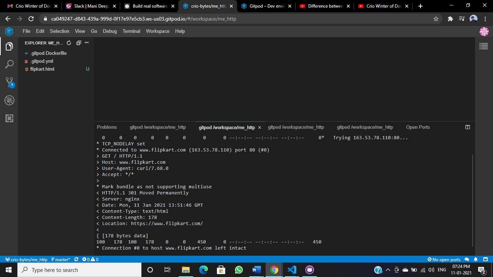
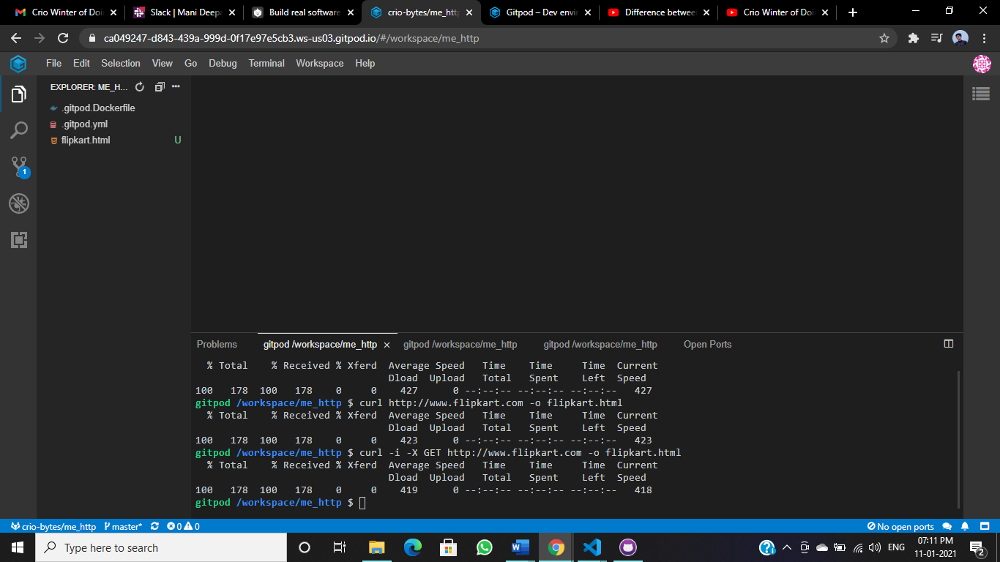

<h2> curl will mimic the output given by chrome dev tools

<h2>curl -v -X GET http://www.flipkart.com -o flipkart.html

 <h4><i>// -v(verbose log) will log the output //<i></h4>
 
<h4>output log:</h4>

<h2>curl -X GET http://www.flipkart.com -o flipkart.html </h2>

<h4><i>//No -v // </h4>
 
<h4>output log:

