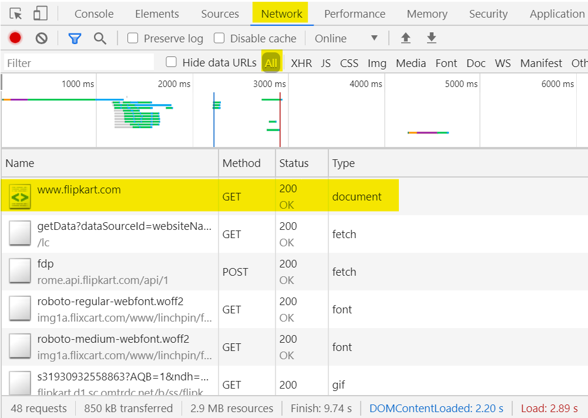

<h1>How do I pass multiple query parameters with a single URL?<h1>
 
<h3>Search parameters come after the ? character. Multiple search parameters can be used by separating them with the & character.
 

For an API that needs to take two search parameters - query(city) and location (country), the request URL should be like this https://www.metaweather.com/api/location/search/?query=san&location=India </h3>

 

 

 

 

 

 
